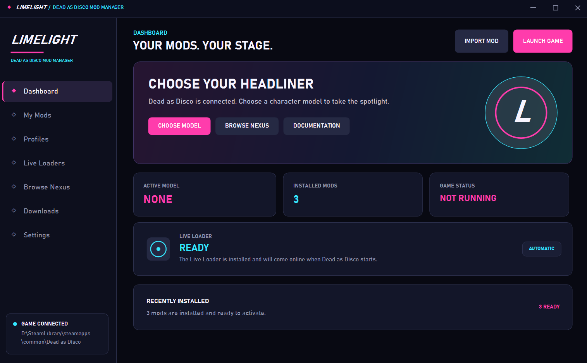
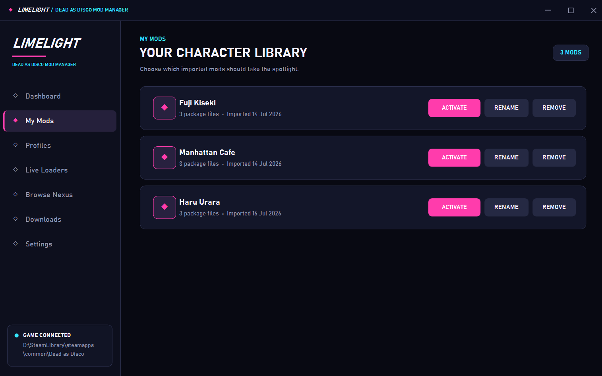
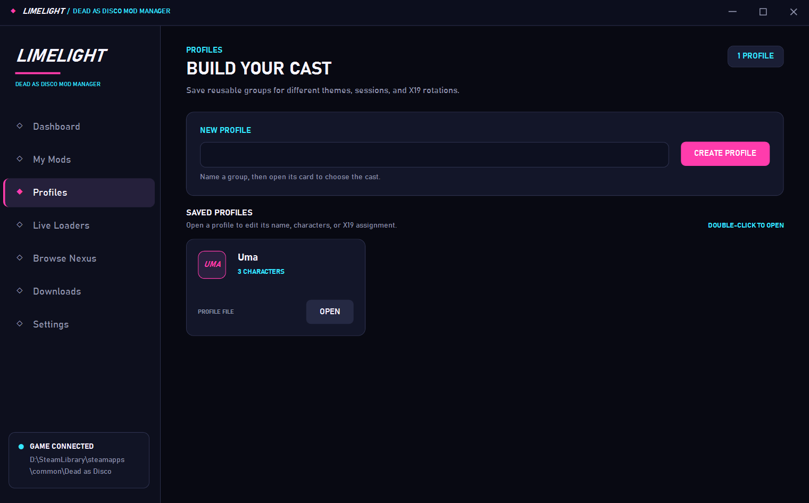
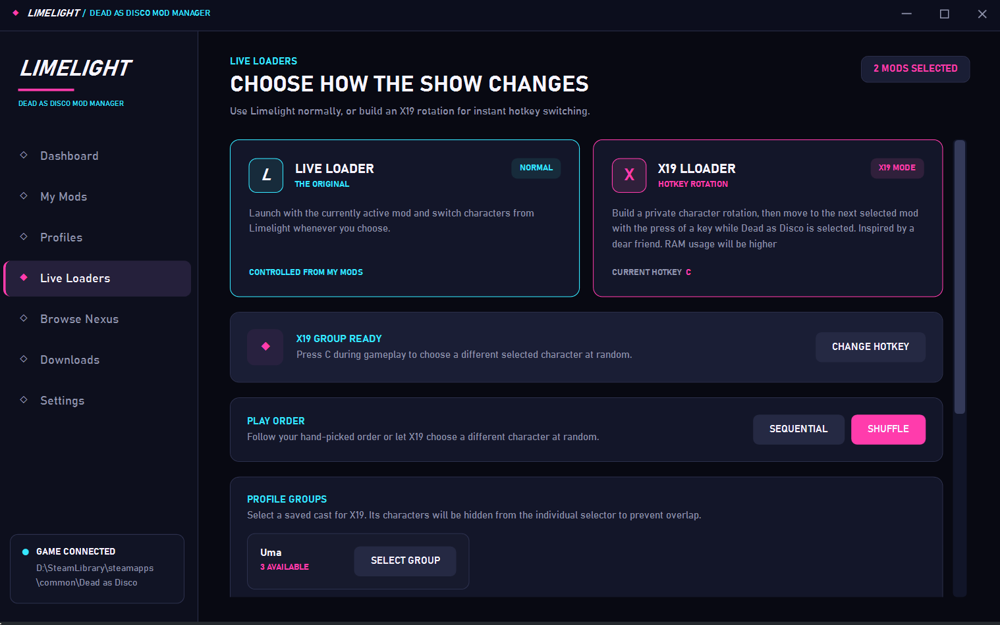

  

<h1 align="center">LIMELIGHT</h1>

  <strong>Your mods. Your stage.</strong> 
  A standalone mod manager and live character loader for <em>Dead as Disco</em>.

  <a href="https://henreh1.github.io/LimelightWiki/">Documentation</a>
  &nbsp;&bull;&nbsp;
  <a href="https://github.com/Henreh1/Limelight/releases">Releases</a>
  &nbsp;&bull;&nbsp;
  <a href="https://github.com/Henreh1/Limelight/issues">Report an issue</a>

> [!IMPORTANT]
> Limelight is currently in Early Access. Nexus Mods browsing and direct downloads are temporarily marked as under construction while application registration is reviewed.

## About Limelight

Limelight keeps character model mods organised and lets supported assets switch while *Dead as Disco* is still running. Point it at the game once, import a mod archive, and manage the rest from one themed desktop application.

The Live Loader installs and configures its managed runtime components automatically. Users do not need to manually copy UE4SS, bridge, or staging files into the game.

## Highlights

| Feature | What it does |
| --- | --- |
| Character library | Import ZIP, RAR, and 7Z archives, drag and drop mods, rename entries, reject duplicates, and remove mods from one library. |
| Normal Live Loader | Activate a supported character replacement without restarting the game. |
| Character Slot Loader support | Detect a slot mod's data asset and unique mesh, keep its original Locker layout, and switch it through Normal Live Loader or X19. |
| X19 LLoader | Rotate through a chosen cast by keyboard or controller, in order or shuffled. |
| Profiles | Save reusable groups of characters and assign an entire profile to X19 rotation. |
| Asset-aware switching | Scan each imported Unreal container and refresh the model, materials, textures, portraits, and supported localisation assets it replaces. |
| Safe switching | Detect game transitions, block unsafe requests, reuse mounted containers, and show a subtle Limelight pulse while X19 changes character. |
| Compatibility checks | Verify the game build, UE4SS runtime, Lua bridge, and native bridge before enabling live switching. |
| Recovery and reports | Repair managed loader files and create privacy-conscious diagnostic or private test reports. |
| Windows integration | Themed dialogs, a themed file explorer, Discord Rich Presence, optional resource monitoring, and a guided first-run tour. |

## Screenshots

### Dashboard

  

### Character library

  

### Profiles

  

### Live Loaders

  

### Subtle X19 feedback

X19 keeps the game view clean. During a character switch, this translucent Limelight mark briefly pulses in the corner instead of covering gameplay with a full status panel.

  

## Requirements

- Windows 10 or Windows 11, 64-bit
- A Steam installation of *Dead as Disco*
- Enough free space for Limelight, managed loader files, imported mods, and temporary staging
- The game must be closed while Limelight installs or repairs the Live Loader

The normal installer includes the .NET runtime required by Limelight.

## Getting started

1. Download the latest installer from [Releases](https://github.com/Henreh1/Limelight/releases).
2. Install and open Limelight.
3. Choose the folder containing `Dead as Disco` when prompted.
4. Import a supported mod ZIP, RAR, or 7Z archive, or drag it onto the Limelight window.
5. Open **My Mods** and activate the character you want to use.
6. Select **Launch Game**, then choose Normal Live Loader, X19 LLoader, or launch without live switching.

Limelight keeps its mod library, profiles, settings, reports, and temporary runtime data inside the current Windows account. Uninstalling the application does not silently delete the user's library.

## Live Loader modes

### Normal Live Loader

Use the character library to choose each active mod manually. This is the simplest mode for players who want one character at a time with full switching feedback.

### X19 LLoader

Build a rotation from individual characters or a saved profile, then advance through it with a configurable keyboard or controller button. X19 supports sequential and shuffled rotation, prevents overlapping requests, and limits input handling to *Dead as Disco*.

### No Live Loader

Launch the game without starting live switching. This reduces startup time and resource use when Limelight's runtime features are not needed.

## Mod compatibility

Limelight is primarily designed for Unreal Engine IoStore character replacements containing matching `.pak`, `.ucas`, and `.utoc` files. Imported archives are validated before entering the library.

Character Slot Loader packages are detected when `info.json` names a character whose matching `PPCD_<CharacterName>` data asset and skeletal mesh are present under `/Game/Pagoda/Characters/Player/ModdedCharacters/<CharacterName>`. Limelight preserves the contained folder needed by the in-game Locker, live-mounts its PPCD definition, and applies that definition through the game's own body-type cosmetic pipeline in Normal Live Loader or X19 instead of requiring an `SK_Charlie` replacement. The original Character Loader Logic Mod remains a separate dependency: install its `CharacterLoader.pak`, `.ucas`, and `.utoc` files in `Pagoda\Content\Paks\LogicMods` and restart the game. Limelight detects and works with those files but does not redistribute them.

Live switching depends on the contents and structure of each mod. A mod that works after restarting the game may still contain assets that Unreal cannot safely replace at runtime. See the [compatibility guide](https://henreh1.github.io/LimelightWiki/mod-compatibility.html) for current details.

## Nexus Mods status

The Nexus catalogue interface, mod detail pages, image carousel, download history, and credential protection have been implemented and privately tested. Public access is paused until Nexus Mods completes Limelight's application registration review.

Limelight does not expose a personal API key in diagnostic reports. Public builds will follow the registered authentication flow required by Nexus Mods.

## Documentation and support

- Read the [Limelight documentation](https://henreh1.github.io/LimelightWiki/)
- Review [troubleshooting and recovery](https://henreh1.github.io/LimelightWiki/troubleshooting.html)
- Create a themed diagnostic or private test report from **Settings > Support**
- Report reproducible problems through [GitHub Issues](https://github.com/Henreh1/Limelight/issues)

Please do not include personal API credentials, private files, or unrelated crash data in a public report.

## Credits

Created by **Henreh**.

A massive thank you to the people at **Brain Jar Games** for making *Dead as Disco* exist.

Special thanks to the Limelight testers:

- **X19**
- **Taxes I Hate Em**
- **Bananas**

Limelight also builds on the work of the [RE-UE4SS](https://github.com/UE4SS-RE/RE-UE4SS) and [CUE4Parse](https://github.com/FabianFG/CUE4Parse) projects.

  <strong>Henreh &lt;3</strong>

